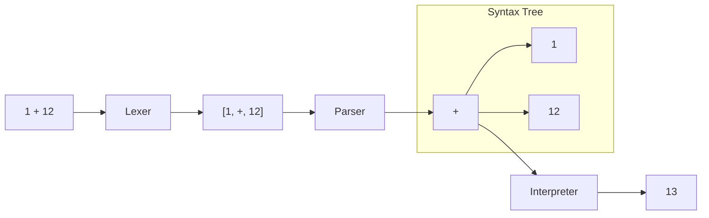
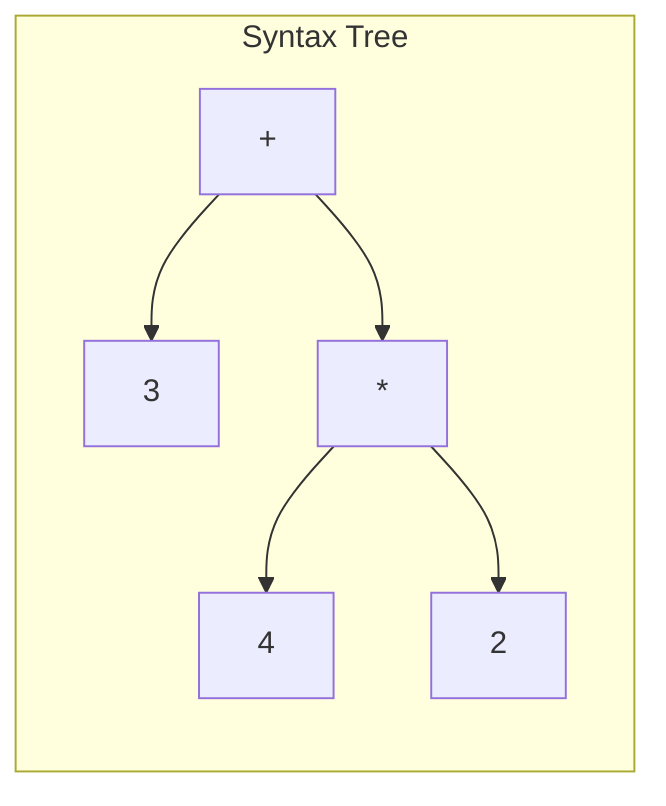

Today, I'll be covering how to implement a calculator interpreter (i.e. evaluating `1 + 2 * 3` as `7`). First we'll cover the overall concept, and then we'll dive into the details of how to implement it.

> #### This post has interactive components demonstrating the concepts, make sure to try them out by modifying the expressions in the input boxes with the mouse pointer icons!

<!--truncate-->

import Collapse from "@site/src/components/Collapse";

## Problem Statement

> Given a string `s` representing a valid expression, implement a calculator interpreter to evaluate it, and return the result of the evaluation.

> **Example 1:**
>
> ```
> Input: s = "1 + 1"
> Output: 2
> ```

> **Example 2:**
>
> ```
> Input: s = " 2 - 1 + 2 "
> Output: 3
> ```

> **Example 3:**
>
> ```
> Input: s = "1 + 2 * 3"
> Output: 7
> ```

> **Example 4:**
>
> ```
> Input: s = "(1 + 2 * 3) * 2"
> Output: 14
> ```

The provided expression can contain the following:

- Addition `+`
- Subtraction `-`
- Multiplication `*`
- Division `/`
- Negation `-` (unary)
- Parentheses `(` and `)`
- Whitespace ` `
- Integers `0-MAX_INT`

## How should I approach the solution?

One way to approach this problem is to utilize a stack (or set of stacks) to keep track of the current state of the expression. We can then iterate through the expression, and push/pop values from the stack as we encounter them. This approach is fairly simple, but it can be difficult to debug and extend.

Another approach is to use a more formalized approach composed of three modules commonly used in [computer language parsing](https://en.wikipedia.org/wiki/Parsing).

### Language Parsing

We will break the problem down into three sub-problems:

| Sub-Problem        | Module      | Description                                      |
| ------------------ | ----------- | ------------------------------------------------ |
| Lexical Analysis   | Lexer       | Convert the input string into a list of tokens.  |
| Syntactic Analysis | Parser      | Converts the list of tokens into a syntax tree.  |
| Evaluation         | Interpreter | Evaluate the syntax tree, and return the result. |

<Collapse title="What are tokens and syntax trees?">

What is a token?

> A token is the smallest element of a program that is meaningful in syntactic analysis. In the case of a calculator, a token can be a number, an operation, or a parenthesis. Notice that a token is not necessarily a single character, it can be a sequence of characters, like a number composed of multiple digits.

What is a syntax tree?

> A syntax tree is a representation of the tokens (although not every token must be represented in the tree) that captures the meaning of the expression. This tree encodes the relationship of symbols in the expression such that the interpreter can correctly evaluate the result of the expression. In the case of a calculator, the syntax tree will be a tree, where each node is an operation, and each leaf node is a number.

</Collapse>

Applied to this problem:



By breaking the problem down into these sub-problems, we can implement and test in a more iterative fashion before assembling the final solution.

## How do I implement the solution?

Let's get coding! We'll start with the lexer.

### Lexer

import { useMemo, useState } from "react";

import LexerView from "../src/components/basic-calculator/LexerView";
import TextInput from "../src/components/basic-calculator/TextInput";
import { useBasicCalculatorStore } from "../src/components/basic-calculator/utils";

The lexer for this problem is fairly simple. For each character in our input string, we will do the following:

- If a valid operation character, add as a token.
- If a digit, concatenate the digits until the next non-digit character, and add as a token.
- All other characters (invalid operations or whitespace) will be ignored.

We will report an error if the input string contains any characters outside of the valid character set.

<Collapse title="View code">

[View in GitHub](https://github.com/ericdudley/ericdudley/blob/main/src/utils/basic-calculator/lexer.ts)

```ts
export class Lexer {
  inputText: string;
  tokens: string[];
  idx: number;

  constructor(inputText: string) {
    this.inputText = inputText;
    this.idx = 0;
    this.tokens = [];

    let i = 0;
    let currNum = "";

    while (i < inputText.length) {
      while (DIGITS.has(inputText[i])) {
        currNum += inputText[i];
        i += 1;
      }

      if (currNum.length > 0) {
        this.tokens.push(currNum);
        currNum = "";
      }

      if (OPERATIONS.has(inputText[i])) {
        this.tokens.push(inputText[i]);
      }

      i += 1;
    }
  }

  getNextToken() {
    if (this.idx === this.tokens.length) {
      return null;
    } else {
      const token = this.tokens[this.idx];
      this.idx += 1;
      return token;
    }
  }

  peekNextToken() {
    if (this.idx === this.tokens.length) {
      return null;
    } else {
      const token = this.tokens[this.idx];
      return token;
    }
  }

  hasNextToken() {
    return this.idx < this.tokens.length;
  }

  isValid() {
    return Array.from(this.inputText).every(
      (c) => DIGITS.has(c) || OPERATIONS.has(c) || c === " "
    );
  }
}
```

</Collapse>

Try adding some input text below, to see how the lexer will tokenize it.

<TextInput />
<LexerView />

Awesome, now that our lexer is producing tokens, we can feed these tokens into the next module, the parser.

### Parser

import ParserView from "../src/components/basic-calculator/ParserView";

The parser is the most complicated part of this problem, we need to convert the list of tokens into a syntax tree. The syntax tree is a representation of the input string, where each node is an operation, and each leaf node is a number.

- If the node is a binary operation (+, -, \*, /), it will have two children, the left and right operands.
- If the node is a unary operation (-, ()), it will have one child, the operand, stored in the right child.
- If the node is a number, it will store a value and have no children. This is a leaf node.

<Collapse title="Learn more about how the parser works">

#### Understanding the Parser

This parser is classified as a **Recursive Descent Parser**, a top-down parsing method.

##### Core Concepts

1. **Grammar**:
   - `expression` represents operations like addition (`+`) or subtraction (`-`). An expression can be composed of one or more `terms` separated by addition or subtraction.
   - `term` concerns itself with multiplication (`*`) or division (`/`). A term can be composed of one or more `factors` separated by multiplication or division.
   - `factor` A factor can be a constant (like `1` or `2`), or an expression (like `1 + 2` or `(1 + 2) * 3`).

##### Enforcing Order of Operations:

The recursive structure of this parser enables it to intuitively enforce the order of operations.

**Expression -> Term -> Factor**: At the highest level, when parsing an `expression`, the parser looks for `terms`, and within each term, it searches for `factors`. This hierarchical descent ensures that the foundational mathematical operations (those within parentheses or just standalone numbers) are processed first (`factors`), followed by multiplication and division (`terms`), and finally addition and subtraction (`expression`).

**An example**: Consider the input `3 + 4 * 2`.

1. **Initialization**: The parser starts at the `expression` level.

2. **Finding the First Term**:

   - At the `expression` level, it seeks its first `term`.
   - Within the `term`, it looks for its first `factor`.
   - At the `factor` level, it identifies `3`.
   - `3` is then returned upwards as the first `term` to the `expression` level.

3. **Recognizing the Addition Operation**:

   - The `expression` level spots the next token as an addition (`+`).
   - Consequently, an addition node is initialized. The parser now needs another `term` to complete this addition operation.

4. **Identifying the Next Term**:

   - Diving back to the `term` level, the parser identifies the next `factor` as `4`.

5. **Spotting the Multiplication Operation**:

   - Remaining within the `term` level, the parser identifies the subsequent token as multiplication (`*`).
   - It then establishes a multiplication node, asking for another `factor` to complete this multiplication.

6. **Completing the Multiplication**:

   - Descending once more to the `factor` level, it discovers `2` as the next `factor`.
   - `2` is sent upward, completing the multiplication node.

7. **Wrapping it up**:
   - This multiplication node, representing `4 * 2`, is then passed up to the `expression` level.
   - It serves as the second `term` for our initially established addition node.
   - With no more tokens left, the `expression` level concludes the parsing, and the final result is the addition node that encompasses the entire expression: `3 + (4 * 2)`.



tldr; The parser will always process the deepest nested (highest-precedence) operations first, and then work its way back up.

##### Error Handling

1. **Errors**: Any deviations from expected constructs will result in an error message; however, the parser will always try to complete the parse and return a tree. For example, if there are missing parentheses at the end of an expression `3 * (1 + 2`, the parser will still return the correct result, but will also return an error message.

</Collapse>

<Collapse title="View code">

[View in GitHub](https://github.com/ericdudley/ericdudley/blob/main/src/utils/basic-calculator/parser.ts)

```ts
import { v4 as uuid } from "uuid";
import { OPERATIONS } from "./constants";
import { Lexer } from "./lexer";
import { Node, NullableNode } from "./node";

/**
 * expression - addition or subtraction
 * term - multiplication or division
 * factor - constant or parantheses
 */
export class Parser {
  lexer: Lexer;
  error?: string;

  constructor(lexer: Lexer) {
    this.lexer = lexer;
  }

  parse(): { result?: NullableNode; error?: string } {
    try {
      const result = this.getExpression();

      if (this.lexer.hasNextToken()) {
        return {
          result,
          error: "Completed parsing, but did not read all tokens.",
        };
      }
      return { result, error: this.error };
    } catch (error) {
      if (error) {
        return {
          error: error.message ?? "Unknown error",
        };
      }
    }
  }

  getExpression(): NullableNode {
    let node = this.getTerm();

    while (
      node &&
      (this.lexer.peekNextToken() === "+" || this.lexer.peekNextToken() === "-")
    ) {
      const token = this.lexer.getNextToken();

      node = new Node({
        type: token === "+" ? "add" : "sub",
        left: node,
        right: this.getTerm(),
      });
    }

    return node;
  }

  getTerm(): NullableNode {
    let node = this.getFactor();

    while (
      node &&
      (this.lexer.peekNextToken() === "*" || this.lexer.peekNextToken() === "/")
    ) {
      const token = this.lexer.getNextToken();

      node = new Node({
        type: token === "*" ? "mul" : "div",
        left: node,
        right: this.getFactor(),
      });
    }

    return node;
  }

  getFactor(): NullableNode {
    const token = this.lexer.getNextToken();

    if (token == null) {
      return null;
    } else if (token === "(") {
      const node = new Node({
        type: "par",
        right: this.getExpression(),
      });

      if (this.lexer.peekNextToken() === ")") {
        this.lexer.getNextToken();
      } else {
        this.error = "Missing close parentheses";
      }

      return node;
    } else if (OPERATIONS.has(token)) {
      return null;
    } else {
      return new Node({
        type: "val",
        val: Number(token),
      });
    }
  }

  getTreeViewData(): { treeData?: TreeData; error?: string } {
    const parsed = this.parse();

    function getTree(node: NullableNode): TreeData {
      if (!node) {
        return null;
      }

      if (node.type === "val") {
        return {
          name: String(node.val),
          key: uuid(),
        };
      }

      if (node.type === "add") {
        return {
          name: "+",
          key: uuid(),
          children: [node.left, node.right]
            .map((child) => getTree(child))
            .filter((child) => !!child),
        };
      }

      if (node.type === "sub") {
        return {
          name: "-",
          key: uuid(),
          children: [node.left, node.right]
            .map((child) => getTree(child))
            .filter((child) => !!child),
        };
      }

      if (node.type === "mul") {
        return {
          name: "*",
          key: uuid(),
          children: [node.left, node.right]
            .map((child) => getTree(child))
            .filter((child) => !!child),
        };
      }

      if (node.type === "div") {
        return {
          name: "/",
          key: uuid(),
          children: [node.left, node.right]
            .map((child) => getTree(child))
            .filter((child) => !!child),
        };
      }

      if (node.type === "neg") {
        return {
          name: "-1 *",
          key: uuid(),
          children: [node.right]
            .map((child) => getTree(child))
            .filter((child) => !!child),
        };
      }

      if (node.type === "par") {
        return {
          name: "()",
          key: uuid(),
          children: [node.right]
            .map((child) => getTree(child))
            .filter((child) => !!child),
        };
      }
    }

    return { treeData: getTree(parsed.result), error: parsed.error };
  }
}
```

</Collapse>

<TextInput />
<ParserView />

### Interpreter

import InterpreterView from "../src/components/basic-calculator/InterpreterView";

Since our parser returns our tokens as a syntax tree with meaningful structure, we can now evaluate the expression by recursively traversing the tree and applying the operations from the leaves up to the root.

1. Base case: If the node is a number, return the value.
2. Recursive case:
   - If the node is a unary operation, evaluate the right child, and apply the operation to the resulting value.
   - If the node is a binary operation, evaluate the left and right children, and apply the operation to the resulting values.

<Collapse title="View code">

[View in GitHub](https://github.com/ericdudley/ericdudley/blob/main/src/utils/basic-calculator/interpreter.ts)

```ts
import { Parser } from "./parser";
import { NullableNode } from "./node";
import { formatNumber } from "./constants";

export class Interpreter {
  parser: Parser;
  error?: string;

  constructor(parser: Parser) {
    this.parser = parser;
  }

  _interpret(root: NullableNode, steps: string[]): number {
    if (!root) {
      return 0;
    }

    let val: number;
    let step: string;

    switch (root.type) {
      case "val": {
        val = root.val;
        break;
      }
      case "neg": {
        const right = this._interpret(root.right, steps);
        val = -1 * right;
        step = `-1 * ${formatNumber(right)}`;
        break;
      }
      case "add": {
        const left = this._interpret(root.left, steps);
        const right = this._interpret(root.right, steps);
        val = left + right;
        step = `${formatNumber(left)} + ${formatNumber(right)}`;
        break;
      }
      case "sub": {
        const left = this._interpret(root.left, steps);
        const right = this._interpret(root.right, steps);
        val = left - right;
        step = `${formatNumber(left)} - ${formatNumber(right)}`;
        break;
      }
      case "par": {
        const right = this._interpret(root.right, steps);
        val = right;
        break;
      }
      case "mul": {
        const left = this._interpret(root.left, steps);
        const right = this._interpret(root.right, steps);
        val = left * right;
        step = `${formatNumber(left)} * ${formatNumber(right)}`;
        break;
      }
      case "div": {
        const left = this._interpret(root.left, steps);
        const right = this._interpret(root.right, steps);
        val = left / right;
        step = `${formatNumber(left)} / ${formatNumber(right)}`;
        break;
      }
      default:
        this.error = `Unknown node type: ${root.type}`;
    }

    if (step) {
      steps.push(`${step} = ${formatNumber(val)}`);
    }
    return val;
  }

  interpret(): { steps: string[]; value: number; error?: string } {
    this.error = "";
    const steps = [];
    const { result } = this.parser.parse();
    const value = this._interpret(result, steps);
    return {
      value,
      steps,
      error: this.error,
    };
  }
}
```

</Collapse>

<TextInput />
<InterpreterView />

## Conclusion

In this post, we've implemented a calculator interpreter, along the way, touching upon the principles of language parsing. By dividing our main task into three distinct modules — lexer, parser, and interpreter — we were able to break down the problem into smaller, more manageable pieces. This approach allowed us to test each module individually, and then assemble the final solution. I hope you enjoyed this post, and learned something new!
